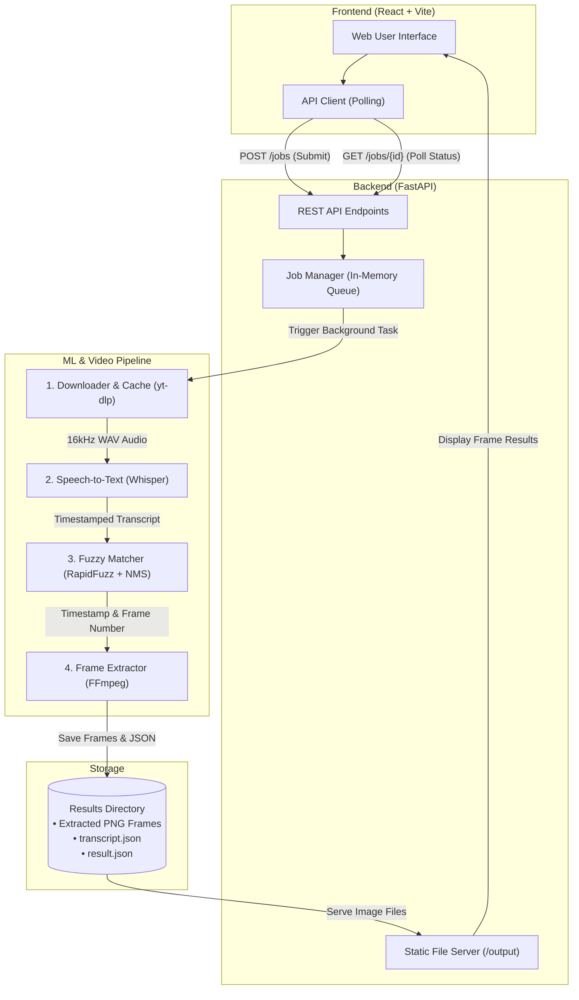
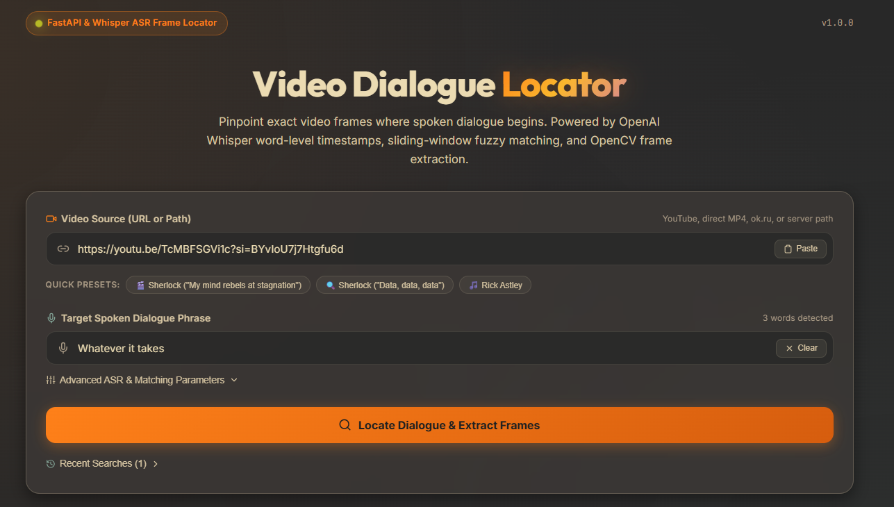
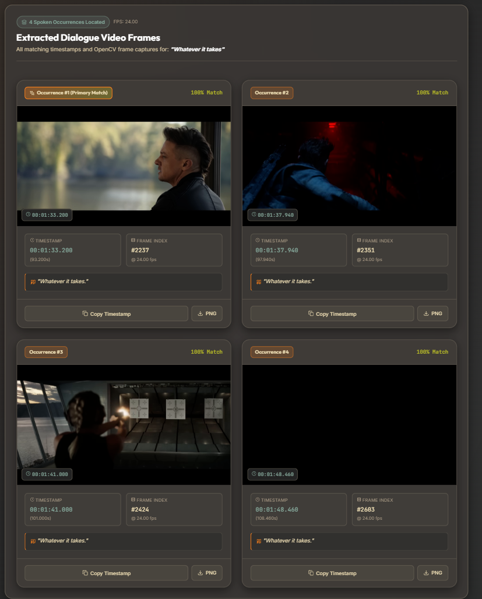

# Video Dialogue Locator 

An AI-powered, full-stack web application and automated ML pipeline designed to locate the exact timestamp, frame number, and high-resolution video frame where a specific spoken dialogue occurs in any online or local video.

Built with **FastAPI**, **OpenAI Whisper ASR**, **RapidFuzz**, **FFmpeg**, and **React (Vite)**.

---

##  Key Features

* **ASR-First Dialogue Localization**: Uses OpenAI Whisper to transcribe audio directly with word-level timestamps, eliminating dependency on burned-in on-screen text or subtitle tracks.
* **Temporal Non-Maximum Suppression (NMS)**: Suppresses duplicate frames from adjacent sliding-window hits while accurately capturing all distinct repeated occurrences across a video.
* **Accurate & Fast Frame Extraction**: Computes exact frame numbers (`Frame Number = round(timestamp * FPS)`) via `ffprobe` stream metadata and extracts lossless PNG frames using FFmpeg fast input seek in `< 300 ms`.
* **Persistent Media Caching**: Caches downloaded video and extracted 16kHz mono audio in `media_cache/`, speeding up repeated queries on the same video from minutes to under 3 seconds.
* **Asynchronous REST API**: FastAPI backend with non-blocking `POST /jobs` job creation, thread-safe in-memory state tracking (`queued` → `processing` → `completed` / `failed`), and static image serving at `/output`.
* **Interactive Gruvbox Web UI**: Single-page dashboard featuring one-click sample presets, Whisper model selector (`tiny` to `large`), fuzzy similarity threshold slider, real-time polling progress, full-resolution image modal, and search history drawer.

---

##  Tech Stack

| Layer | Technology | Purpose |
| :--- | :--- | :--- |
| **Frontend** | React 18, Vite | Interactive Single Page Application (SPA) |
| **UI Styling** | Vanilla CSS (Gruvbox Dark) | Clean, responsive glassmorphism theme |
| **Backend API** | FastAPI, Uvicorn, Pydantic v2 | High-performance asynchronous REST API |
| **Speech Recognition** | OpenAI Whisper | Neural ASR with word-level timestamp alignment |
| **Fuzzy Matching** | RapidFuzz | Sliding-window token matching & temporal NMS |
| **Media Ingestion** | yt-dlp | Video and audio streaming/downloading |
| **Video Processing** | FFmpeg & ffprobe | Dynamic FPS detection & fast frame extraction |
| **Storage & Cache** | Local Filesystem | Structured media cache & isolated per-job artifacts |

---

##  Architecture Diagram



> For full architectural details, see [documentations/arch_diagram.md](documentations/arch_diagram.md).

---

##  Project Documentation

For deeper technical insights, explore the dedicated documentation files:

* **[Software Requirements Specification (SRS)](documentations/SRS.md)**: Formal requirements, problem evolution from OCR to ASR, and functional specifications.
* **[Technical Design Decisions](documentations/design-decisions.md)**: Architectural choices, trade-offs, algorithms, and code references.
* **[Challenges Faced & Solutions](documentations/Challenges_faced.md)**: Practical obstacles encountered during development (caching, geoblocking, NMS, polling) and how they were resolved.
* **[Architecture Diagram](documentations/arch_diagram.md)**: Clean Mermaid system diagram and end-to-end component flow.

---

##  Screenshots

### 1. Job Submission & Configuration


### 2. Multi-Match Frame Visualizer & Results


---

##  Prerequisites

Ensure the following tools are installed on your system before running:

* **Python 3.10+** (Python 3.11 recommended)
* **Node.js 18+** and **npm**
* **FFmpeg** and **ffprobe** (must be added to your system `PATH`)
  * Verify via terminal: `ffmpeg -version` and `ffprobe -version`

---

##  Getting Started (Run Locally)

### 1. Clone the Repository
```bash
git clone https://github.com/Ankith-55/Quest1.git
cd Quest1
```

---

### 2. Backend Setup (FastAPI)

1. Navigate to the `backend/` directory:
   ```bash
   cd backend
   ```

2. Create and activate a Python virtual environment:
   ```bash
   # Windows (PowerShell)
   python -m venv venv
   .\venv\Scripts\activate

   # Linux / macOS
   python3 -m venv venv
   source venv/bin/activate
   ```

3. Install required dependencies:
   ```bash
   pip install -r requirements.txt
   ```

4. Start the FastAPI development server:
   ```bash
   uvicorn app.main:app --reload --host 0.0.0.0 --port 8000
   ```

* **API Server:** [http://localhost:8000](http://localhost:8000)
* **Interactive Swagger Docs:** [http://localhost:8000/docs](http://localhost:8000/docs)
* **Health Check:** [http://localhost:8000/health](http://localhost:8000/health)

---

### 3. Frontend Setup (React + Vite)

1. Open a new terminal and navigate to the `frontend/` directory:
   ```bash
   cd frontend
   ```

2. Install Node dependencies:
   ```bash
   npm install
   ```

3. Start the Vite development server:
   ```bash
   npm run dev
   ```

* **Web UI:** [http://localhost:5173](http://localhost:5173)

---

##  Basic Usage

1. Open [http://localhost:5173](http://localhost:5173) in your browser.
2. Enter any supported video URL (e.g., YouTube, ok.ru, or direct MP4 link) or click one of the preset sample buttons.
3. Enter the target dialogue phrase you wish to locate (e.g., *"My mind rebels at stagnation"* or *"Whatever it takes"*).
4. Optionally choose a Whisper model size (`base` recommended) and set your similarity threshold (default: `90%`).
5. Click **"Locate Dialogue & Extract Frames"**.
6. Monitor the real-time progress bar. Once completed, review the extracted frames, exact timestamp (`HH:MM:SS.sss`), calculated frame number, and confidence percentage. Click any frame to inspect it at full resolution.

