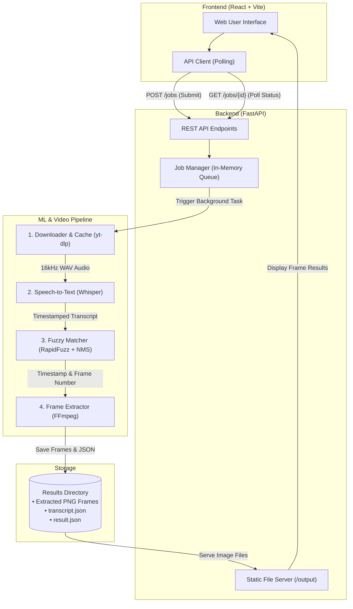

# Architecture Diagram

A high-level overview of the Video Dialogue Locator application architecture.

```mermaid
flowchart TD
    subgraph Frontend["Frontend (React + Vite)"]
        UI["Web User Interface"]
        APIClient["API Client (Polling)"]
        UI --> APIClient
    end

    subgraph Backend["Backend (FastAPI)"]
        API["REST API Endpoints"]
        JobMgr["Job Manager (In-Memory Queue)"]
        Static["Static File Server (/output)"]
        
        API --> JobMgr
    end

    subgraph Pipeline["ML & Video Pipeline"]
        Downloader["1. Downloader & Cache (yt-dlp)"]
        Whisper["2. Speech-to-Text (Whisper)"]
        Matcher["3. Fuzzy Matcher (RapidFuzz + NMS)"]
        Extractor["4. Frame Extractor (FFmpeg)"]

        Downloader -->|"16kHz WAV Audio"| Whisper
        Whisper -->|"Timestamped Transcript"| Matcher
        Matcher -->|"Timestamp & Frame Number"| Extractor
    end

    subgraph Storage["Storage"]
        Results[("Results Directory<br/>• Extracted PNG Frames<br/>• transcript.json<br/>• result.json")]
    end

    %% Connections
    APIClient -->|"POST /jobs (Submit)"| API
    APIClient -->|"GET /jobs/{id} (Poll Status)"| API
    JobMgr -->|"Trigger Background Task"| Downloader
    Extractor -->|"Save Frames & JSON"| Results
    Results -->|"Serve Image Files"| Static
    Static -->|"Display Frame Results"| UI
```

